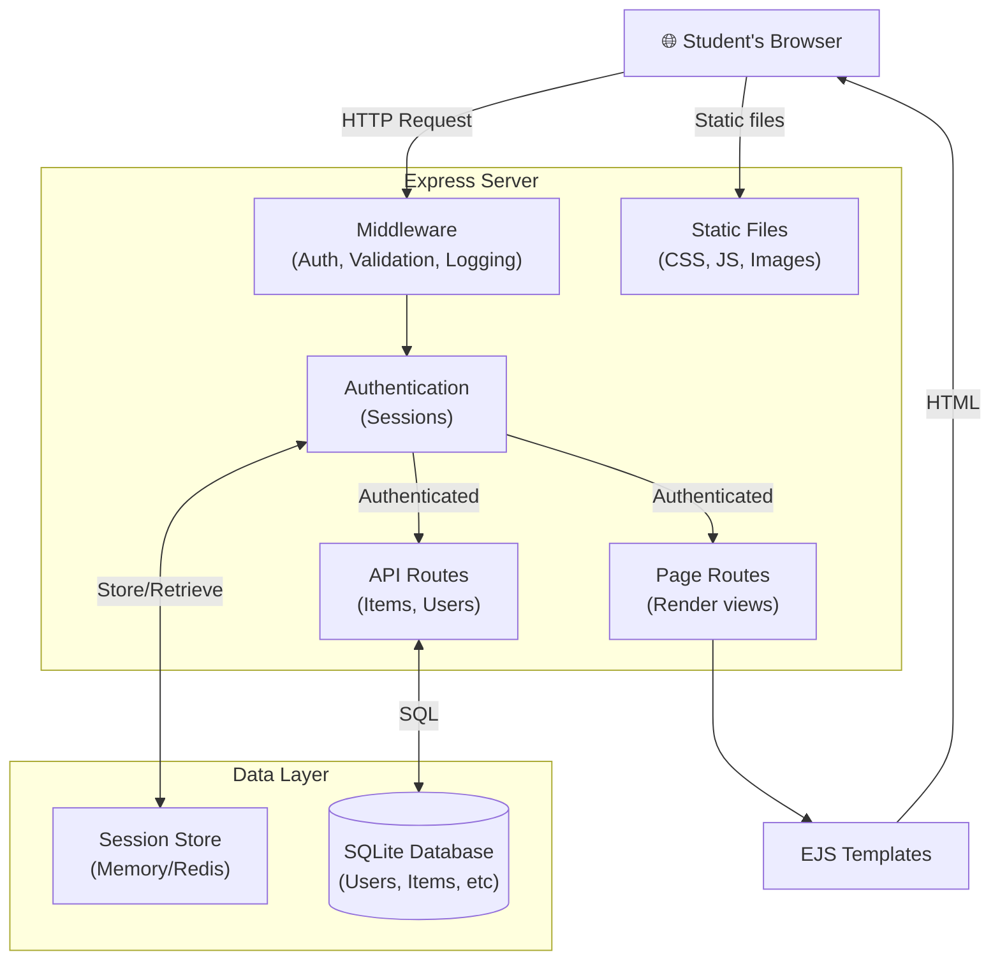

```mermaid
flowchart TD
    B["🌐 Student's Browser"]
    
    subgraph Server["Express Server"]
        MW["Middleware<br/>(Auth, Validation, Logging)"]
        Auth["Authentication<br/>(Sessions)"]
        API["API Routes<br/>(Items, Users)"]
        Pages["Page Routes<br/>(Render views)"]
        Static["Static Files<br/>(CSS, JS, Images)"]
    end
    
    subgraph Data["Data Layer"]
        Sessions["Session Store<br/>(Memory/Redis)"]
        DB[("SQLite Database<br/>(Users, Items, etc)")]
    end
    
    Templates["EJS Templates"]
    
    B -->|HTTP Request| MW
    MW --> Auth
    Auth -->|Authenticated| API
    Auth -->|Authenticated| Pages
    API <-->|SQL| DB
    Pages --> Templates
    Templates -->|HTML| B
    B -->|Static files| Static
    Auth <-->|Store/Retrieve| Sessions
```
