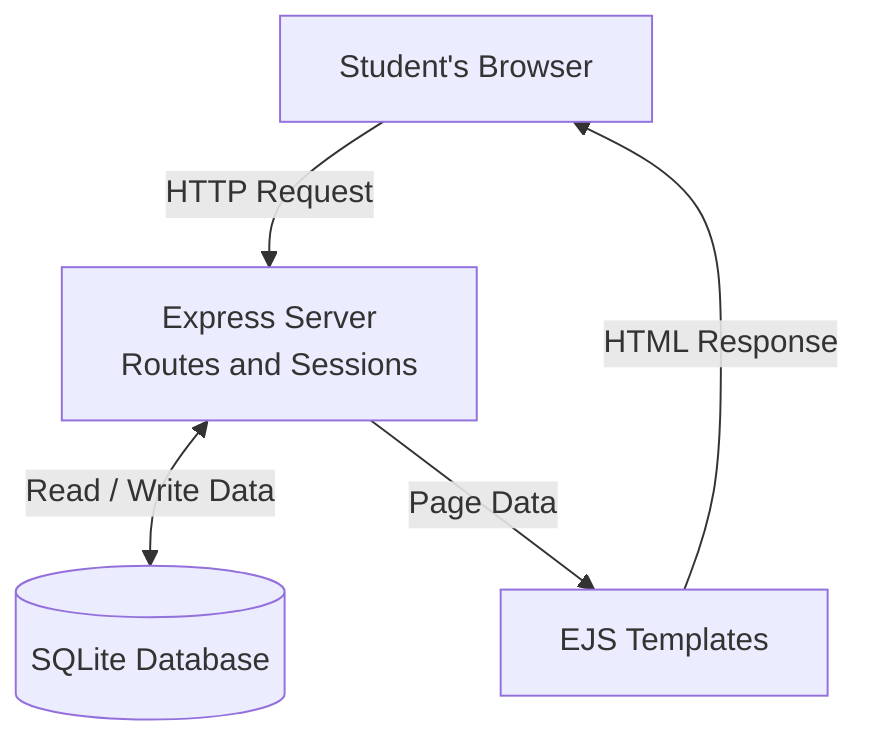

```mermaid
flowchart TD
    Browser["Student's Browser"]
    Server["Express Server<br/>Routes and Sessions"]
    DB[("SQLite Database")]
    Views["EJS Templates"]

    Browser -->|"HTTP Request"| Server
    Server <-->|"Read / Write Data"| DB
    Server -->|"Page Data"| Views
    Views -->|"HTML Response"| Browser
```
