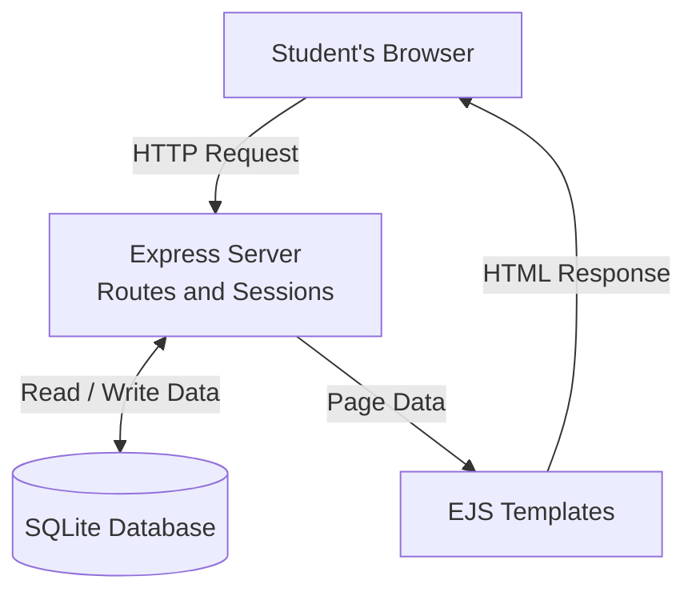

- **Creating a post:** The browser submits a form to POST /items. The route uses requireAuth, validates the fields, and inserts a SQLite row associated with req.session.user.id. It redirects the browser to view the new listing.

- **Authentication and ownership:** Protected item routes use requireAuth. Resolving a post additionally checks that the logged-in user owns it.

- **Search and item pages:** The board reads search and filter values from URL query parameters. After the patch, it binds those values to SQL placeholders. Individual item pages fetch a row using its ID.

- **Page rendering:** Routes pass database results to EJS templates, which produce HTML for the browser.
